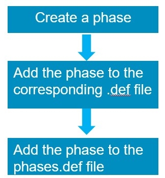

# OpenArkCompiler Phase Design

OpenArkCompiler comes with a series of optimization measures managed in phase mode. This document describes how to design, use, and define a phase by taking middle end as an example.

## Phase

Middle end involves ModulePhase and MeFuncPhase inherited from the Phase class. The Run method is the most important for the Phase class. Two overloads of the method depend on whether analysis is required.

```cpp
virtual AnalysisResult *Run(MeFunction *ir, MeFuncResultMgr *frm) {
  return nullptr;
}

// By default mrm will not be used because most ME phases do not need 
// IPA result. For those will use IPA result, this function will be overrode.
virtual AnalysisResult *Run(MeFunction *ir, MeFuncResultMgr *frm, ModuleResultMgr *mrm) {
  return Run(ir, frm);
}
```

Therefore, when adding a new phase, at least one Run method must be implemented, and the PhaseName method must be overridden to return the phase name. The following uses rclowering as an example:

```cpp
class MeDoRCLowering : public MeFuncPhase {
 public:
  MeDoRCLowering(MePhaseID id) : MeFuncPhase(id) {}

  virtual ~MeDoRCLowering() = default;
  AnalysisResult *Run(MeFunction*, MeFuncResultMgr*, ModuleResultMgr*) override;
  const std::string PhaseName() const override {
    return "rclowering";
  }
};
```

```cpp
AnalysisResult *MeDoRCLowering::Run(MeFunction *func, MeFuncResultMgr *m, ModuleResultMgr *mrm) {
  KlassHierarchy *kh = static_cast<KlassHierarchy*>(mrm->GetAnalysisResult(MoPhase_CHA, &func->GetMIRModule())); 
  DASSERT(kh != nullptr, "KlassHierarchy has problem");
  MeIRMap *hmap = static_cast<MeIRMap*>(m->GetAnalysisResult(MeFuncPhase_IRMAP, func));
  DASSERT(hmap != nullptr, "hssamap has problem");
  RCLowering rclowering(func, kh);
  MIRFunction *mirfunction = func->GetMirFunc();
  DASSERT(mirfunction->GetModule()->CurFunction() == mirfunction, "unexpected CurFunction");
  string funcname = mirfunction->GetName();
  if (DEBUGFUNC(func)) {
    LogInfo::MapleLogger() << "Handling function " << funcname << std::endl;
  }
  ...
```


# PhaseManager

PhaseManager creates, manages, and runs phases. PhaseManager is classified into ModulePhaseManager and MeFuncPhaseManager.
PhaseManager registers all phases it supports so that users can add phases through the add phase interface.

**1. Registering a phase**

Take MeFuncPhaseManager as an example. It is registered through the RegisterFuncPhases method. The registered phase is managed through the registeredPhases map.

```cpp
void MeFuncPhaseManager::RegisterFuncPhases() {
  // register all Funcphases defined in mephases.def
#define FUNCTPHASE(id, mephase)                                                 \
  do {                                                                          \
    void *buf = GetMemAllocator()->GetMemPool()->Malloc(sizeof(mephase(id)));   \
    ASSERT(buf != nullptr, "null ptr check");                                   \                
    RegisterPhase(id, (new (buf) mephase(id)));                                 \                
  } while (0);
#define FUNCAPHASE(id, mephase)          
  do {                                                                           \        
    void *buf = GetMemAllocator()->GetMemPool()->Malloc(sizeof(mephase(id)));    \   
    ASSERT(buf != nullptr, "null ptr check");                                    \    
    RegisterPhase(id, (new (buf) mephase(id)));                                  \   
    arFuncManager.AddAnalysisPhase(id,(static_cast<MeFuncPhase*>(GetPhase(id))));\  
  } while (0);
#include "mephases.def"
#undef FUNCTPHASE
#undef FUNCAPHASE
}
void RegisterPhase(PhaseId id, Phase *p) {
  registeredPhases[id] = p;
}
```

Here, a macro is used for registration, which facilitates the management of phases to be registered. Only the corresponding .def file needs editing. The content of the mephases.def file is as follows. The first parameter is id, and the second parameter is the phase class name.

```cpp
FUNCAPHASE(MeFuncPhase_SSATAB, MeDoSSATab)
FUNCAPHASE(MeFuncPhase_ALIASCLASS, MeDoAliasClass)
FUNCAPHASE(MeFuncPhase_SSA, MeDoSSA)
```

To support the rclowering phase mentioned above, add the following line:

```
FUNCTPHASE(MeFuncPhase_RCLOWERING, MeDoRCLowering)
```

**2. Adding a phase**

The phase manager subclass provides interfaces for adding phases. After processing input, the interfaces call the AddPhase method of the PhaseManager base class.

```cpp
void MeFuncPhaseManager::AddPhasesNoDefault(std::vector<std::string> &phases) {
  for (unsigned i = 0; i < phases.size(); i++) {
    PhaseManager::AddPhase(phases[i].c_str());
  }
  DASSERT(phases.size() == GetphaseSeq()->size(), "invalid phase name");
}

void AddPhase(const std::string &pname) {
  for (auto it = RegPhaseBegin(); it != RegPhaseEnd(); it++) {
    if (GetPhaseName(it) == pname) {
      phaseSequences.push_back(GetPhaseId(it));
      phaseTimers.push_back(0);
      return;
    }
  }
...
```

The added phase is managed by MapleVector.

## InterleavedManager and DriverRunner

In addition, users can use the framework composed of InterleavedManager and DriverRunner to manage phases more effectively.

**1. InterleavedManager**

InterleavedManager creates, manages, and runs phase managers. By invoking the AddPhases interface, InterleavedManager creates a phase manager of the corresponding type and adds it to MapleVector. At the same time, the registration and adding of phases corresponding to the phase managers are triggered automatically.

```cpp
void InterleavedManager::AddPhases(vector<string> &phases, bool isModulePhase, bool timephases, bool genmpl) {
  ModuleResultMgr *mrm = nullptr;
  if (!phaseManagers.empty()) {
    // ModuleResult such class hierarchy need to be carried on
    ModulePhaseManager *mpm = dynamic_cast<ModulePhaseManager*>(phaseManagers[phaseManagers.size()-1]);
    MeFuncPhaseManager *mepm = dynamic_cast<MeFuncPhaseManager*>(phaseManagers[phaseManagers.size()-1]);
    if (mpm != nullptr) {
      mrm = mpm->GetModResultMgr();
    } else if (mepm != nullptr) {
      mrm = mepm->GetModResultMgr();
    }
  }
  if (isModulePhase) {
    ModulePhaseManager *mpm = GetMempool()->New<ModulePhaseManager>(GetMempool(), &mirmodule, mrm);
    mpm->RegisterModulePhases();
    mpm->AddModulePhases(phases);
    if (timephases) {
      mpm->SetTimePhases(true);
    }
    phaseManagers.push_back(mpm);
...
```

The Run method of InterleavedManager runs all managed phase managers in turn.

```cpp
void InterleavedManager::Run() {
  for (PhaseManager *const &pm : phaseManagers) {
    if (dynamic_cast<MeFuncPhaseManager*>(pm)) {
      MeFuncPhaseManager *fpm = static_cast<MeFuncPhaseManager*>(pm);
      unsigned long rangeNum = 0;
      MapleVector<MIRFunction*> *compList;
      if (!mirmodule.GetCompilationList().empty()) {
  ...
```

**2. DriverRunner**

DriverRunner contains all the processes from an .mpl file to an optimized final file. The ParseInput method is used to parse the .mpl file. The ProcessMpl2mplAndMePhases method is used to manage and run phases through InterleavedManager.

DriverRunner also manages phases through a macro. All phases in the phases.def file are traversed and corresponding phase managers are created through the InitPhases interface.

The content of the phases.def file is as follows:

```cpp
// Phase arguments are: name, condition. By default, all phases are required, so 
// the condition value is 'true'.
// You can use condition to control these phases and your custom phases. E.g. 
// ADD_PHASE("custom_phase", option1 == value1 [more conditions...]).
ADD_PHASE("classhierarchy", true)
ADD_PHASE("vtableanalysis", true)
ADD_PHASE("reflectionanalysis", true)
ADD_PHASE("gencheckcast", true)
ADD_PHASE("javaintrnlowering", true)
// mephase begin
ADD_PHASE("ssatab", true)
ADD_PHASE("aliasclass", true)
ADD_PHASE("ssa", true)
ADD_PHASE("analyzerc", true)
ADD_PHASE("rclowering", true)
ADD_PHASE("emit", true)
// mephase end
ADD_PHASE("GenNativeStubFunc", true)
ADD_PHASE("clinit", true)
ADD_PHASE("VtableImpl", true)
ADD_PHASE("javaehlower", true)
ADD_PHASE("MUIDReplacement", true)
```

The first parameter is the phase name, and the second parameter is the condition. All existing phases are enabled by default. For user-defined phases, control conditions can be added.

With the ProcessMpl2mplAndMePhases method, the phases.def file can be included and added to MapleVector through a macro.

```cpp
#include "../defs/phases.def"
```

```cpp
#define ADD_PHASE(name, condition)  \
  if ((condition)) {                \
    phases.push_back(string(name)); \
  }
```


The InitPhases interface decomposes the added phase into the phase manager set of InterleavedManager.

```cpp
void DriverRunner::InitPhases(InterleavedManager &mgr, vector<string> &phases) const {
  if (phases.empty()) {
    return;
  }
  const PhaseManager *curManager = nullptr;
  vector<string> curPhases;

  for (string phase : phases) {
    auto temp = mgr.GetSupportPhaseManager(phase);
    if (temp != nullptr) {
      if (temp != curManager) {
        AddPhases(mgr, curPhases, curManager);
        curManager = temp;
        curPhases.clear();
      }
      AddPhase(curPhases, phase, curManager);
    }
  }

  AddPhases(mgr, curPhases, curManager);
}
```

GetSupportPhaseManager is used to obtain the phase manager corresponding to the current phase.

Summary:
- The Phase class and its two main subclasses ModulePhase and MeFuncPhase can be extended to add and define phases.
- The PhaseManager class and its two main subclasses ModulePhaseManager and MeFuncPhaseManager are used to manage the registration and addition of phases.
- The InterleavedManager class is used to create, manage, and run phase managers.
- The DriverRunner class contains all the processes from a .mpl file to an optimized final file.    The ParseInput method is used to parse the .mpl file. The ProcessMpl2mplAndMePhases method is used to manage and run phases through InterleavedManager.


With the preceding framework, perform the following steps to apply a defined phase to the system.



